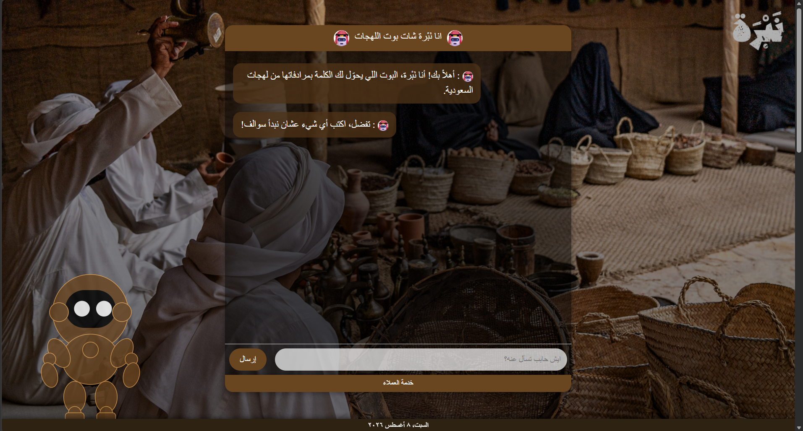
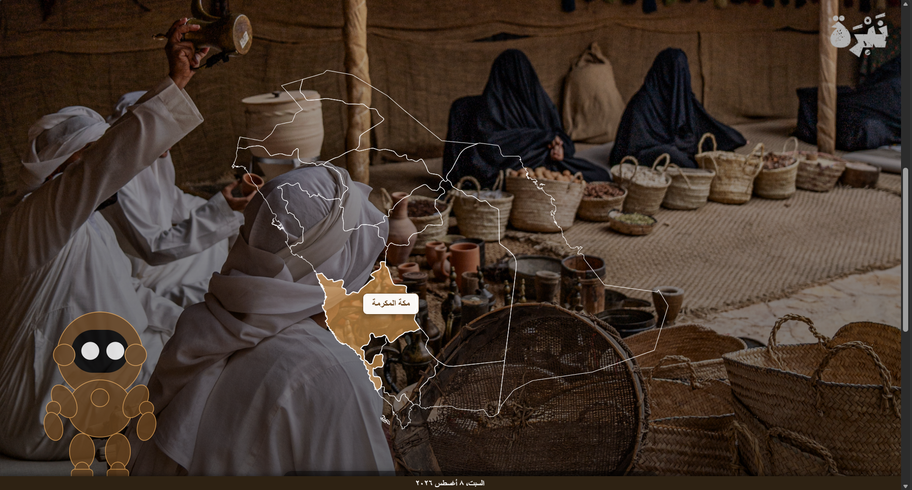
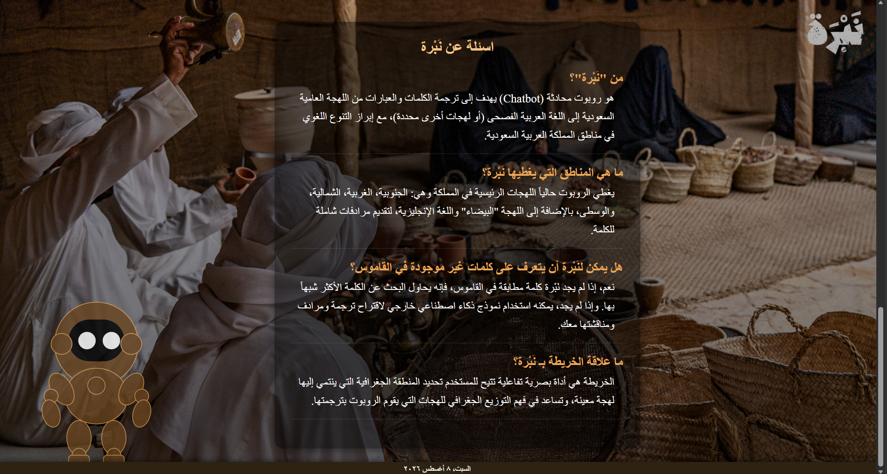

     

<p align="center">
  
</p>


# Nabrah
An AI-powered Saudi dialect chatbot that combines a local JSON dictionary with Gemini AI to explain, translate, and preserve Saudi dialect words through an interactive web application.

---

# About the Project

**Nabrah** is a graduation project developed to preserve Saudi dialects and make them easier to understand through an intelligent chatbot.

The application first searches for words inside a local **JSON dictionary** containing Saudi dialect vocabulary. When a matching word is found, Nabrah displays its meaning in **Modern Standard Arabic (MSA)**, its equivalent in different Saudi dialects, and English translation when available.

If the word is not available in the dictionary, the chatbot uses **Gemini AI** to generate an explanation, ensuring users receive helpful responses while maintaining a smooth experience.

The project also includes an interactive Saudi dialect map and a Frequently Asked Questions page to help users explore the platform.

---

# Project Information

- **Project Type:** Graduation Project
- **Development:** Team Project
- **My Role:** Software Development
- **Year:** 2026

---

# Features

- AI-powered Saudi dialect chatbot.
- Local JSON dictionary for fast word lookup.
- Saudi dialect translation.
- Explain words in Modern Standard Arabic.
- English translation support.
- Gemini AI integration for unknown words.
- Interactive Saudi dialect map.
- Frequently Asked Questions (FAQ).
- Friendly and simple chat interface.
- Fast dictionary-based responses.

---

# Technologies Used

## Backend

- Python
- Flask
- Gemini AI API

## Frontend

- HTML5
- CSS3
- JavaScript

## Data

- JSON Dictionary

---

# My Contribution

This project was developed as part of a graduation team project.

### My Responsibilities

- Developed the web application.
- Implemented the chatbot functionality.
- Built the Flask backend.
- Integrated the local JSON dictionary.
- Integrated Gemini AI.
- Developed the frontend using HTML, CSS, and JavaScript.

---

# Screenshots

## Home Page


## Saudi Dialect Map



## Questions



---

# How It Works

1. The user enters a word or sentence.
2. Nabrah searches the local JSON dictionary.
3. If found:
   - Displays the meaning in Modern Standard Arabic.
   - Shows the dialect equivalent.
   - Displays the English translation (when available).
4. If not found:
   - Gemini AI generates an explanation.
5. Users can also explore Saudi dialects using the interactive map.

---

# Project Structure

```
Nabrah/
│
├── app.py
├── dictionary.json
├── index.html
├── style.css
├── script.js
├── requirements.txt
├── README.md
├── v1.png
└── zz.png
```

---

# Installation

Clone the repository

```bash
git clone https://github.com/NadaAljohani14/nabrah-chatbot.git
```

Move into the project

```bash
cd nabrah-chatbot
```

Install dependencies

```bash
pip install -r requirements.txt
```

Run the application

```bash
python app.py
```

Open your browser

```
http://127.0.0.1:5000
```

---

# Future Improvements

- Expand the Saudi dialect dictionary with more vocabulary.
- Support additional Saudi dialects.
- Improve spelling correction.
- Voice input and speech output.
- User favorites and search history.
- Better AI-assisted explanations.
- Mobile application version.

---

# Developer

**Nada Baker Aljohani**

Digital College of Technology for Girls (TVTC) – Jeddah

Web Developer - Graduation Year: 2026
